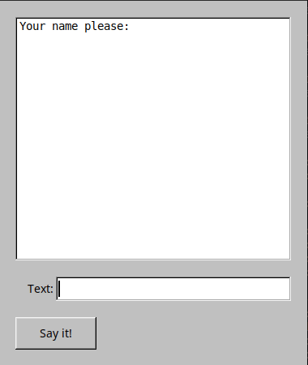

TCP Chat Client (C++/FLTK)



Requirements

    C++ Compiler (g++)

    FLTK 1.3+ (installed in the system)

    Linux/Unix-like OS (tested on Ubuntu)

1. Installing dependencies (Ubuntu/Debian)

```bash
    sudo apt update
    sudo apt install g++ make libfltk1.3-dev
    make
```

2. Project assembly
```bash
    cd src/
    make
```

3. Client Launch
```bash
    ./client_chat <IP> <PORT>
```

Example:

    `./client_chat 127.0.0.1 7777`

Functionality:
  * Connecting to a TCP chat server
  * Graphical User Interface (FLTK)
  * Entering messages via a text field
  * Displaying the message history
  * Automatic scrolling of new messages

Management:

  * Enter the text in the input field and press:
        Enter - send a message
        "Say it!" button - send a message

  * exit - shut down the client
